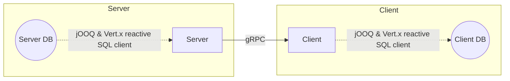

# quarkus-high-off-heap-mem-usage

Simple project to reproduce a suspicious behavior where the off heap memory seems to go wild.

See https://github.com/quarkusio/quarkus/discussions/36691

## Architecture

- `spec` - gRPC specifications (used by both the server and client)
- `server` - Server project
- `client` - Client project



Note:
- There are some duplicated code between server and client because this project is a throwaway.
- In this test project, both server and client databases are on the same PostgreSQL server (localhost:5432)

## Build

1. Start the database

```sh
docker run -d \
    --rm \
    --name db \
    -p 5432:5432 \
    --network host \
    -e POSTGRES_USER=foo \
    -e POSTGRES_PASSWORD=bar \
    postgres:15-bullseye
```

Create the databases and insert data (in the server db only):

```sh
PGPASSWORD=bar \
    && psql -h localhost -p 5432 -U foo -f db/init.sql \
    && psql -h localhost -p 5432 -U foo -d client -f db/client-init.sql \
    && psql -h localhost -p 5432 -U foo -d server -f db/server-init.sql \
    && unzip db/server-data.sql.zip -d db/ \
    && psql -h localhost -p 5432 -U foo -d server -f db/server-data.sql -q -1 \
    && rm -v db/server-data.sql
```

**Optional**: To generate another set of data, use:

```sh
./db/generate-server-data.mjs \
    && PGPASSWORD=bar psql -h localhost -p 5432 -U foo -d server -f db/server-data.sql -q -1
```

2. Build the spec project

```sh
cd spec && ./mvnw clean install && cd ..
```

3. Build the server and client OCI images

```sh
cd server \
    && ./mvnw clean package -Dquarkus.container-image.build=true \
    && cd ../client \
    && ./mvnw clean package -Dquarkus.container-image.build=true \
    && cd ..
```

The OCI images are only built locally with name `quarkus-high-off-heap-mem-usage/(server or client)`.

## Run

```sh
# Server
docker run \
    --rm \
    --network host \
    --name server \
    -m 2048m \
    --cpus=2 \
    -e JAVA_OPTS="-Xms1024m -Xmx1024m" \
    -v /tmp:/tmp \
    quarkus-high-off-heap-mem-usage/server:1.0.0-SNAPSHOT
```

```sh
# Client
docker run \
    --rm \
    --network host \
    --name client \
    -m 1024m \
    --cpus=2 \
    -e JAVA_OPTS="-Xms256m -Xmx256m" \
    -v /tmp:/tmp \
    quarkus-high-off-heap-mem-usage/client:1.0.0-SNAPSHOT
```

## Cleanup

```sh
docker rm --force server \
    && docker rm --force client \
    && docker rm --force db \
    && docker rmi quarkus-high-off-heap-mem-usage/server:1.0.0-SNAPSHOT -f \
    && docker rmi quarkus-high-off-heap-mem-usage/client:1.0.0-SNAPSHOT -f \
    && docker rmi postgres:15-bullseye
```
