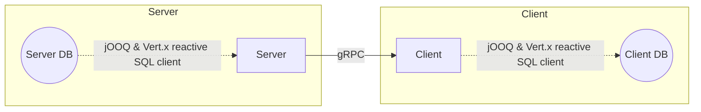
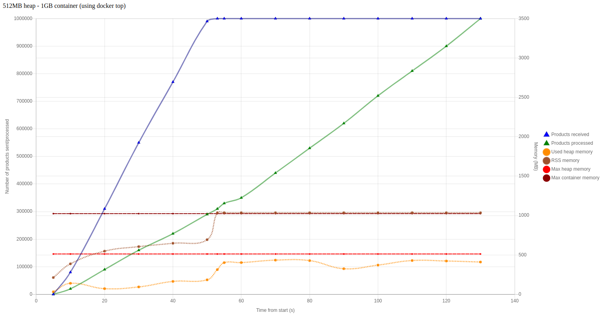
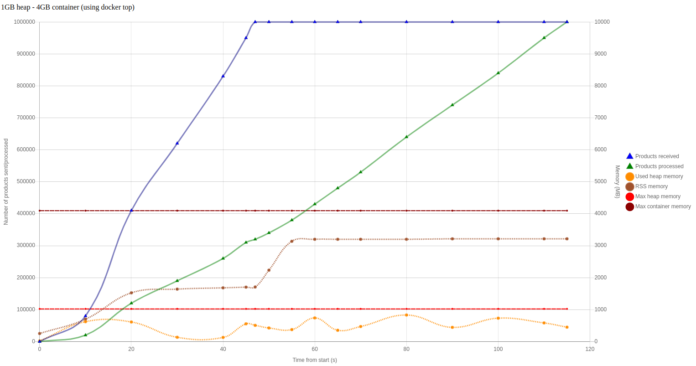
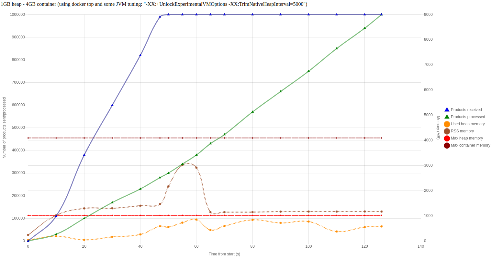
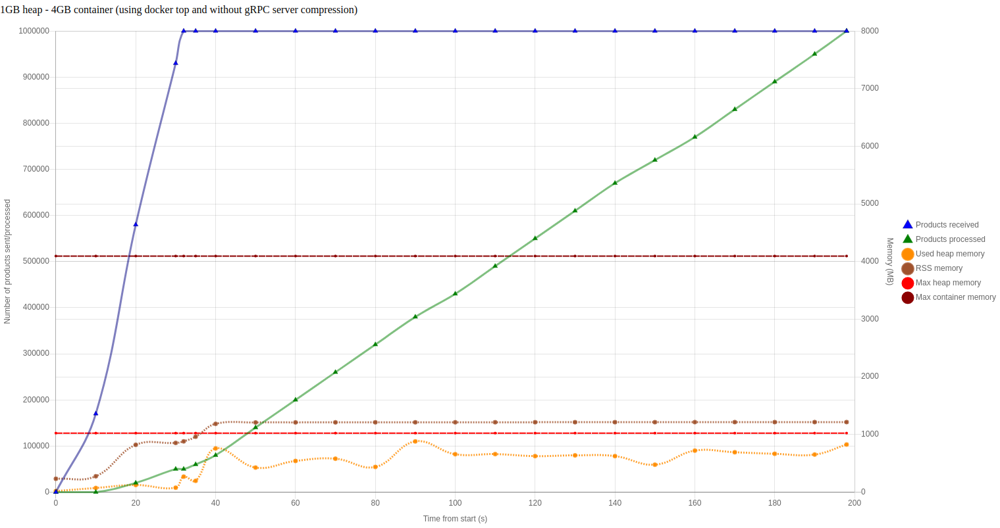

# quarkus-high-off-heap-mem-usage

Simple project to reproduce a suspicious behavior where the off heap memory seems to go wild.

See https://github.com/quarkusio/quarkus/discussions/36691

**Fixed in https://github.com/eclipse-vertx/vertx-grpc/pull/81**

## Architecture

- `spec` - gRPC specifications (used by both the server and client)
- `server` - Server project
- `client` - Client project



Note:
- There are some duplicated code between server and client because this project is a throwaway.
- In this test project, both server and client databases are on the same PostgreSQL server (localhost:5432)

## Build

1. Start the database

```sh
docker run -d \
    --rm \
    --name db \
    -p 5432:5432 \
    --network host \
    -e POSTGRES_USER=foo \
    -e POSTGRES_PASSWORD=bar \
    postgres:15-bullseye
```

Create the databases and insert data (in the server db only):

```sh
PGPASSWORD=bar \
    && psql -h localhost -p 5432 -U foo -f db/init.sql \
    && psql -h localhost -p 5432 -U foo -d client -f db/client-init.sql \
    && psql -h localhost -p 5432 -U foo -d server -f db/server-init.sql \
    && unzip db/server-data.sql.zip -d db/ \
    && psql -h localhost -p 5432 -U foo -d server -f db/server-data.sql -q -1 \
    && rm -v db/server-data.sql
```

**Optional**: To generate another set of data, use:

```sh
./db/generate-server-data.mjs \
    && PGPASSWORD=bar psql -h localhost -p 5432 -U foo -d server -f db/server-data.sql -q -1
```

2. Build the spec project

```sh
cd spec && ./mvnw clean install && cd ..
```

3. Build the server and client OCI images

```sh
cd server \
    && ./mvnw clean package -Dquarkus.container-image.build=true \
    && cd ../client \
    && ./mvnw clean package -Dquarkus.container-image.build=true \
    && cd ..
```

The OCI images are only built locally with name `quarkus-high-off-heap-mem-usage/(server or client)`.

## Run

```sh
# Server
docker run \
    --rm \
    --network host \
    --name server \
    -m 2048m \
    --cpus=2 \
    -e JAVA_OPTS="-Xms1024m -Xmx1024m" \
    -v /tmp:/tmp \
    quarkus-high-off-heap-mem-usage/server:1.0.0-SNAPSHOT
```

```sh
# Client
docker run \
    --rm \
    --network host \
    --name client \
    -m 4096m \
    --cpus=2 \
    -e JAVA_OPTS="-Xms1024m -Xmx1024m" \
    -v /tmp:/tmp \
    -v /opt/async-profiler:/opt/async-profiler \
    quarkus-high-off-heap-mem-usage/client:1.0.0-SNAPSHOT

# Usage: client [limit] [overflowMode]
- limit: Optional, max number of products to fetch from server. -1 for no limit
- overflowMode: Optional, "drop" or "buffer"
```

## Cleanup

```sh
docker rm --force server \
    && docker rm --force client \
    && docker rm --force db \
    && docker rmi quarkus-high-off-heap-mem-usage/server:1.0.0-SNAPSHOT -f \
    && docker rmi quarkus-high-off-heap-mem-usage/client:1.0.0-SNAPSHOT -f \
    && docker rmi postgres:15-bullseye
```

## Analysis

Go in the [graphs](./graphs) folder to get some graphs about memory usage on the client side and number of products "received" (sent by the server) and "processed" (grouped in chunks and insert into target database).

The problem is related to back-pressure: the producer (server) is faster than the consumer (client) and the messages not processed by the client yet are stored in the off-heap memory (I guess? because the heap memory usage doesn't change that much).

The server sends all the products to the client and the client process them while receiving more products. But once the server is done sending products, the client still process products for a few seconds/minutes.
What is weird is:
- The client container memory (heap+off-heap) is slowly growing up continuously when the server is sending data, even if the heap memory is not changed (the heap does not grow up, thanks to both `Xms` and `Xmx` JVM options set to the same value)
- Once the server is done sending data, there is a little "bump" in the client off-heap memory that increases just when the server send the last data.

What bothers me is that "bump": if the client cannot handle all messages, it should be buffering them continuously so it should look like a straight line since the client started, right? Not a bump just when the server is done!

When using `onOverflow().drop()`, ~80% of messages are dropped but we can still see a "bump" in the client container used memory. Why?! What is stored in that off-heap memory?

**Interesting fact: using the old gRPC client `quarkus.grpc.clients.serv.use-quarkus-grpc-client=false` then the memory "bump" almost disappear!**

Note:
- VisualVM was used to monitor used heap memory
- ~~`docker stats` was used to monitor used container memory~~. **Use `watch -n 1 docker top client -o pid,rss,args` instead**. See https://quarkus.io/guides/performance-measure#measuring-memory-correctly-on-docker
- These values are not high precision results as I recorded my terminal and VisualVM windows and then played/paused the video to write down the numbers every X seconds 😐

### Consequences

- The container used memory can go up to 100% really quick after the server sent everthing to the client. So I guess the kernel just kill it when running on my K8s cluster with ArgoWorkflow.

### How to fix this?

- Make the consumer faster
- ~~Make the producer go slower?~~ *Yeah sure but do we really want that?*
- Implementing a custom back-pressure strategy like mentionned [here](https://quarkus.io/blog/mutiny-back-pressure/): `upstream.get().request(1);`
  - The problem is that I would need to try this and still get a multi at the end to chain this with other operations. The example in the article works because it uses `subscribe()`

### Memory graphs

- Using a 512GB memory heap, in a 1GB client container



- Using a 1GB memory heap, in a 4GB client container



- Using a 1GB memory heap, in a 4GB client container, explicitly using `onOverflow().bufferUnconditionally()` (very similar to the first one. Is it the default strategy? I can't find it written in the docs)

/1gb-4gb-overflow-buffer.png>)

- Using a 1GB memory heap, in a 4GB client container, drop messages on overflow

/1gb-4gb-overflow-drop.png>)

- Using a 1GB memory heap, in a 4GB client container, using the old gRPC client (not based on Vert.x)


- Using a 1GB memory heap, in a 4GB client container and using `-XX:+UnlockExperimentalVMOptions -XX:TrimNativeHeapInterval=5000`



- Using a 1GB memory heap, in a 4GB client container and no server gzip compression



*See more in the [graphs](./graphs) folder.*
